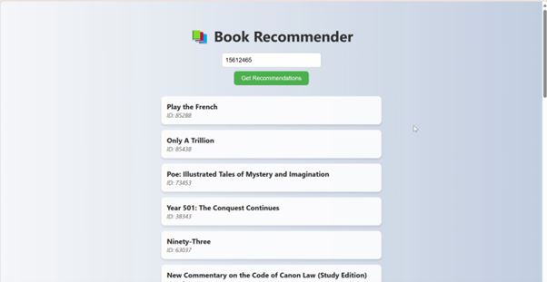

# 📚 AWS Book Recommendation Web App

This is a simple and elegant web app that allows users to receive personalized book recommendations by entering their user ID. It connects to a serverless backend powered by an AWS Lambda function, accessed via a public API.

---

## 🚀 Features

- Clean, mobile-friendly user interface
- Enter your user ID to fetch personalized book recommendations
- Integration with a cloud-based recommendation engine (e.g., Amazon Personalize or custom model via API Gateway & Lambda)
- Smooth loading experience and error handling

---

## 🌐 Tech Stack

- **Frontend:** HTML, CSS, Vanilla JavaScript
- **Backend:** Amazon Personalize, AWS Lambda, Amazon API Gateway, Amazon S3, AWS IAM

---

## 🖥️ How It Works

1. User enters their `user ID`
2. The frontend sends a POST request to the API:  
   `https://mpxxvquxb4.execute-api.ap-southeast-2.amazonaws.com/recommend`
3. Receives a list of recommended books:
   - Title
   - Item ID

4. Books are displayed as styled cards in the results section.

---
### Live Demo


---

## 📁 File Structure

```bash
book-recommender/
│
├── index.html 
├── README.md 
├── generate_schema.py
├── mix_file.py
├── lambda.py
└── assets/ 
    └──book_data.csv
    └──interactions.csv
    └──user_data.csv
```
---
## 📦 Deployment

You can host this frontend on:
- **GitHub Pages** 
- **AWS S3 Static Website Hosting** (AWS account required)
- **Netlify or Vercel**

---

## 📜 License

This project is licensed under the MIT License.

---